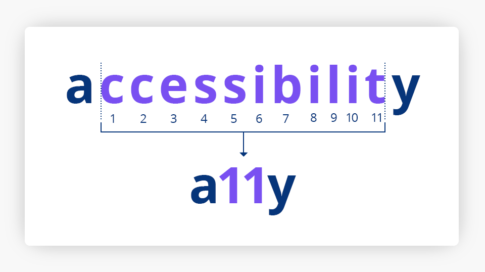
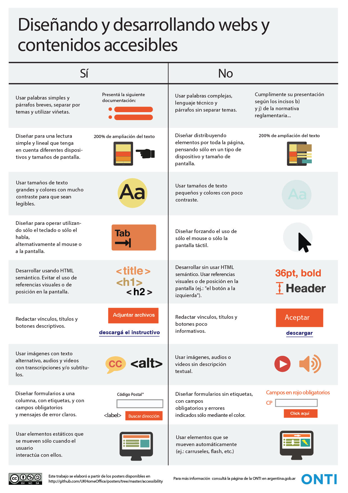

# Accesibilidad Web o Digital

## Concepto

* Es la **práctica inclusiva de garantizar la accesibilidad a los sitios web**, para que todas las personas puedan realizar tareas cotidianas en Internet como:
  * comprar,
  * gestionar trámites,
  * buscar trabajo,
  * estudiar, o
  * divertirse

* Que las herramientas y las tecnologías estén diseñados y desarrollados para que las personas puedan usarlas.

* Para que todos los usuarios puedan **percibir, comprender, navegar, interactuar y contribuir** con la web (aportando a su vez contenidos).

* **a11y**: es el acrónimo internacional de accesibilidad porque hay 11 letras entre la "a" y la "y" de la palabra accesibilidad en ingles.

## Objetivo

* Lograr que las páginas web sean utilizables por el máximo número de personas, independientemente de sus conocimientos o capacidades personales e independientemente de las características técnicas del equipo utilizado para acceder a la Web.

## Acceso universal

* Hablar de AW es hablar de un acceso universal a la Web, independientemente del tipo de:
  * hardware,
  * software,
  * infraestructura de red,
  * idioma,
  * cultura,
  * localización geográfica y
  * capacidades de los usuarios

* La AW nos beneficia a todos (**7700 millones de personas** en el mundo, año 2021). "No se trata solo de que los usuarios discapacitados puedan acceder a tu sitio web, se trata de que TODOS puedan acceder a tu sitio web" [Trenton Moss]

## Componentes que inciden en la AW desde la perspectiva del usuario

* **CONTENIDO WEB** (accesible - sin barreras; inaccesible - con barreras)
* **NAVEGADOR**
* **TECNOLOGIAS DE APOYO** (lector de pantalla, zoom de texto, etc.)
* **USUARIO**
* **ENTORNO DEL AMBIENTE** (barreras del entorno: ambiente ruidoso no permite al usuario oir el audio de un video, un ambiente con iluminación insuficiente dificulta la lectura, conexión a internet limitada no permite acceder a contenido con imágenes o videos, etc)

## Sabias que

* Un sitio web puede ser accesible y no por eso tiene que ser **"feo y aburrido"** (sin imagenes, sin colores, etc.). Solamente hay que agregarles ciertas características para que sean accesibles.
* La AW busca que una página web se **visualice correctamente** en cualquier dispositivo.
* La AW puede ayudar a **mejorar el posicionamiento** de un sitio web.

## Limitaciones

* **Visuales**: desde la baja visión a la ceguera total, además de problemas para distinguir colores (daltonismo). Todos en un día de mucha luminosidad.
* **Motrices**: dificultar o la imposibilidad de usar las manos, incluidos temblores, lentitud muscular, etc. Todos en el caso de una fractura en el brazo.
* **Auditivas**: sordera o deficiencias auditivas.
* **Cognitivas**: dificultades de aprendizaje o discapacidades cognitivas que afecten a la memoria, la atención, las habilidades lógicas, etc.

* A las personas con discapacidad podemos agregar el conjunto de personas de la **"tercera edad"**, ya que las carencias y problemas de los medios físicos, así como muchas veces el contenido, hacen que estas personas se encuentren también en riesgo de infoexclusión.

## Características de un sitio accesible

* **Transformable**: la información y los servicios deben ser accesibles para todos y deben poder ser utilizados con todos los dispositivos de navegación.
* **Comprensible**: contenidos claros y simples.
* **Navegable**: mecanismos sencillos de navegación.

## Beneficios de tener un sitio web accesible

* Mayor exposición de contenido textual a los motores de búsqueda.
* Tener llegada a un número mayor de usuarios.
* Hacer que la Web sea accesible beneficia a las personas, a las empresas y a la sociedad.
  
## Diseño y Desarrollo Web y contenidos accesibles

## Sitios Web con Herramientas de Accesibilidad

* [Chocolates Artesanos Isabel](https://chocolatesartesanosisabel.com/)
* [Boletin Oficial de la República Argentina](https://www.boletinoficial.gob.ar/)

## Unidades Responsables de Accesibilidad (URA)

* Estas unidades son figuras que deben tener los organismos públicos con el fin de garantizar el cumplimiento de la normativa de AW.
* Coordinan el funcionamiento efectivo de los mecanismos de comunicación en materia de AW.
* Funciones:
  * Revisar las evaluaciones realizadas.
  * Atender y dar respuestas a los reclamos.
  * Coordinar las revisiones periódicas de accesibilidad.
  * Coordinar y fomentar las actividades de promoción de la accesibilidad.
