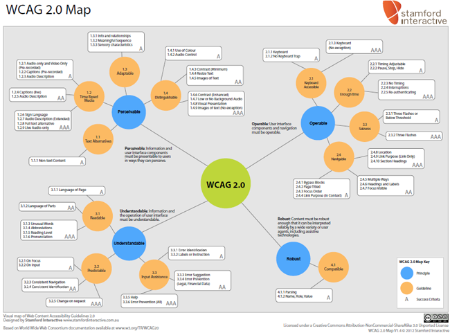

# Pautas y Leyes

## ¿Quien modera la AW?

* W3C ([World Wide Web Consortium](https://www.w3.org/)) es la organización internacional que trabaja en el desarrollo de estándares web.
* En especial su grupo de trabajo permanente WAI ([Web Accessibility Initiative](https://www.w3.org/WAI/)) que se encargan de promover soluciones de accesibilidad en la Web, desarrollando Pautas de Accesibilidad al Contenido Web ([Web Content Accesibility Guidelines - WCAG 2.0](https://www.w3.org/TR/WCAG20/))
* Las pautas del W3C son consideradas como estándares internacionales de AW.
* En muchos países, la legislación sobre AW emplea las pautas del W3C como marco de referencia.

## WCAG 2.0

* Publicada en diciembre de 2008.
* En el año 2012 se convirtió en un standard ISO/IEC 40500:2012, fue un paso importante, porque muchos países lo adoptaron como un standard propio.
* [WCAG 2.0 y WCAG 2.1](https://www.w3.org/WAI/standards-guidelines/wcag/es)

### Estructura

* Principios (4) -> Pautas (12) -> Criterios de conformidad (61) -> Técnicas suficientes y recomendadas (G, H, C) .
* Cada criterio se clasifica en un nivel de conformidad:
  * **A**: usuarios pueden acceder al contenido, (146 técnicas)
  * **AA**: usuarios poca dificultad para acceder al contenido y
  * **AAA**: contenido tenga mínimas situaciones de dificutad para ciertos usuarios
* Cada nivel es incremental.
* En 2018 se publican las WCAG 2.1: esta versión amplia las WCAG 2.0, sumando criterios y una pauta, pero no desaprueba ni reemplaza la versión anterior.
* W3C recomienda el uso de las WCAG 2.1 para facilitar la implementación de buenas prácticas de accesibilidad del contenido en todos los dispositivos y soportes.

#### Principios

| Principio                 | Descripción                                                                                                                                                                          |
|:--------------------------|:-------------------------------------------------------------------------------------------------------------------------------------------------------------------------------------|
| 1. **Perceptible**        | la información y los componentes de la interfaz usuario deben ser presentados a los usuarios de modo que ellos puedan percibirlos. Ejemplo: imágenes con alt, videos con subtítulos.                                                    |
| 2. **Operable**           | los componentes de la interfaz usuario y navegación deben ser operables. Ejemplo: elementos sean accesibles por teclado, tiempo suficiente para poder actuar.                                                                                                              |
| 3. **Comprensible**       | la información y el manejo de la interfaz de usuario deben ser comprensibles. Ejemplo: usar tamaños tipográficos correctos, predecible si se va a hacer un cambio de una pantalla a otra, campos obligatorios, gestión de errores claros.                                                                                                         |
| 4. **Robusto**            | el contenido debe ser suficientemente robusto como para ser interpretado de forma fiable por una amplia variedad de aplicaciones de usuario, incluyendo los productos de apoyo |

#### Pautas

---

* **1.1 Alternativas textuales**: imagenes con alt, videos con subtítulos.
* **1.2 Medios tempodependientes**: usuarios van a poder percibir el contenido de audio y de video.
* **1.3 Adaptable**: utilizarlo en cualquier dispositivo, en cualquier resolución, disposición (horizontal, vertical)
* **1.4 Distinguible**: distinguir colores.

---

* **2.1 Accesible por teclado**: mediante la tecla TAB, que todos los elementos de interacción tengan foco.
* **2.2 Tiempo suficiente**: para poder actuar.
* **2.3 Convulsiones**: animaciones con no mas de 3 destellos por segundo.
* **2.4 Navegable**: y la encontrabilidad (usuarios que puedan encontrar lo que necesitan)

---

* **3.1 Legible**: asegurar de usar los tamaños tipográficos correctos
* **3.2 Predecible**: si se va hacer un cambio de una pantalla a otra, avisar al usuario que se lo va a sacar de contexto.
* **3.3 Entrada de datos asistida**: ejemplo al completar un formulario.

---

* **4.1 Compatible**

---

#### Niveles de conformidad

| Nivel   | Descripción                                                                                                                    |
|:--------|:-------------------------------------------------------------------------------------------------------------------------------|
| **A**   | Para lograr conformidad con el nivel A (el mínimo), la página web satisface todos los criterios de conformidad del nivel A     |
| **AA**  | Para lograr conformidad con el nivel AA, la página web satisface todos los criterios de conformidad de los niveles A y AA      |
| **AAA** | Para lograr conformidad con el nivel AAA, la página web satisface todos los criterios de conformidad de los niveles A, AA y AA |

### En Argentina

* En noviembre 2010 se aprobó en Argentina la [Ley 26653 de accesibilidad de la información en las páginas web](http://www.infoleg.gob.ar/infolegInternet/anexos/175000-179999/175694/norma.htm)

* La Ley garantiza y amplía el acceso a la información pública a las personas con discapacidad.

* Mediante esta ley, el Estado Nacional deberá respetar en los diseños de sus páginas web las normas y requisitos sobre accesibilidad de la información que faciliten el acceso a sus contenidos para todas las personas con discapacidad, con el objeto de garantizarles la igualdad real de oportunidades y trato, evitando así todo tipo de discriminación.

* La [ONTI](https://www.argentina.gob.ar/jefatura/innovacion-publica/onti/accesibilidad-web) es la encargada de conducir en la formulación de políticas e implementación del proceso de desarrollo e innovación tecnológica para la transformación e innovación del Estado Nacional. Es la autoridad de aplicación de la Ley N° 26653.

* La [Disposición ONTI 06/2019](https://www.argentina.gob.ar/normativa/nacional/329284/texto) de setiembre de 2019, establece entre los puntos más importantes:
  * **Art. 1**: Se prueba las WCAG 2.0
  * **Art. 2**: Se aprueba los criterios de conformidad de Nivel A y AA
  * **Art. 3**: Ambos se encontrarán disponibles en el sitio web de la ONTI
  * **Art. 4**: Puntuación: si alcanza 30 de los 38 criterios.
