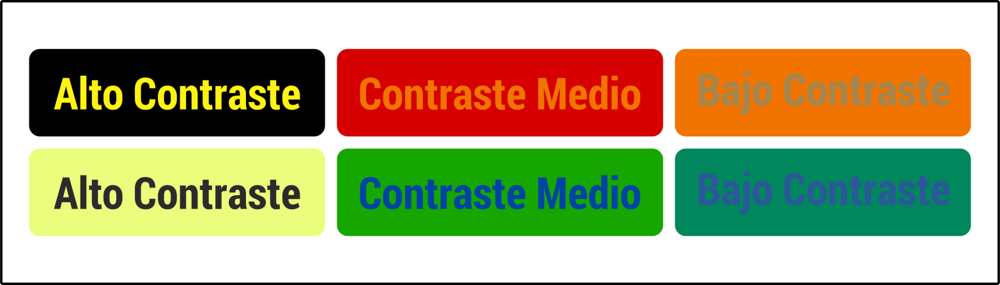

# Diseño accesible

* Usa colores con mucho contraste entre el texto y el fondo para que sea legible. Para texto de tamaño normal la relación de contraste debe ser 4.5:1 y para texto grande (mayor a 18 puntos) de 3:1

* Elegi una paleta cromática para diseñar, con colores accesibles, para que las personas con cualquier tipo de discapacidad visual, daltonismo, o quienes navegan desde un celular a plena luz del sol, puedan visualizar los colores sin problemas.

* Ejemplo de lo que NO se debe hacer

* No uses el color como único medio visual para transmitir la información, indicar una acción, solicitar una respuesta o distinguir un elemento visual.
