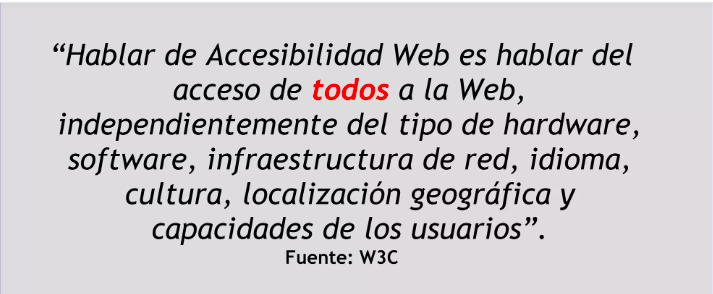
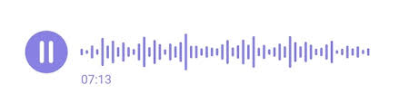
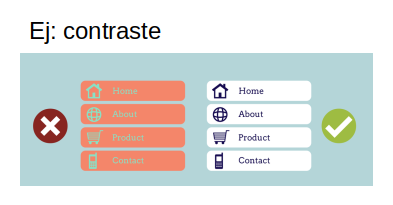
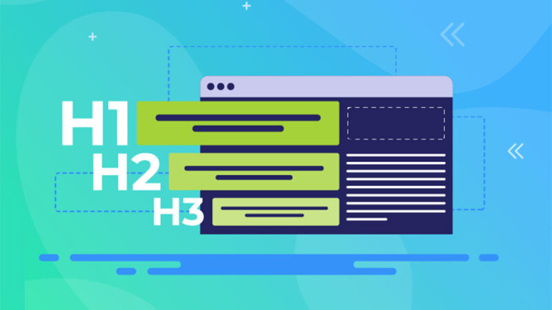
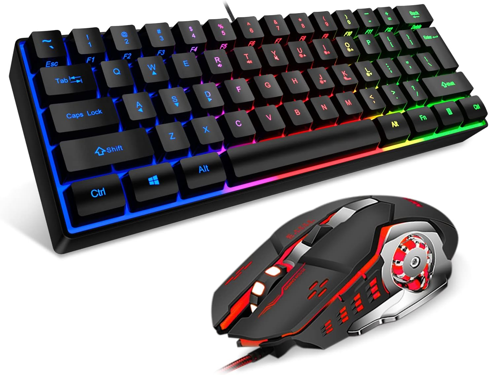
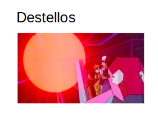

# Taller ---> Testeando la Accesibilidad Web <---

## Agenda

1. **Definiciones**
1. **Legislación**
1. **Metodología**
1. **Herramienta: WA11Y**

## Video: ¿Qué es la accesibilidad web?

[¿Qué es la accesibilidad web?](https://www.youtube.com/watch?v=gQIKQO41pME)

## a11y

## Problemas de accesibilidad en el mundo real

## Definición AW

## Ejemplo

### Lo que estamos viendo

### Lo que ven las personas ciegas

### Datos estadísticos

## Legislación

### Pautas y Leyes a nivel mundial

|||
| -- | -- |
| **W3C**      | World Wide Web Consortium |
| **WAI**      | Web Accessibility Initiative |
| **WCAG 2.0** | Web Content Accessibility Guidelines 2.0 [URL](https://www.w3.org/TR/WCAG20/) |

### WCAG 2.0

### Técnicas

| Criterio 1.1.1 |
| --- |
|  |

---

| Criterio 1.2.2 |
| --- |
|  |

---

| Criterio 1.1.1 |
| --- |
|  |

---

| Criterio 1.4.2 |
| --- |
|  |

---

| Criterio 1.4.3 |
| --- |
|  |
|  |
| Ejemplo: Poco contraste vs Mucho contraste |

---

| Criterio 2.4.2 |
| --- |
|  |

---

| Criterio 2.4.4 |
| --- |
|  |

---

| Criterio 2.1.1 |
| --- |
|  |

---

| Criterio 2.4.3 |
| --- |
|  |

---

| Criterio 2.2.1 |
| --- |
|  |

---

| Criterio 2.3.1 |
| --- |
|  |

---

| |
| -- |
|  |

---

| |
| -- |
|  |

---

| Criterio 3.3.1 |
| --- |
|  |

---

### Video: ¿Cómo diseñar un sitio web accesible?

[¿Cómo diseñar un sitio web accesible?](https://www.youtube.com/watch?v=5WrB508ZpNI)

### Legislación en Argentina

[ONTI](https://www.argentina.gob.ar/jefatura/innovacion-publica/onti/evaluacion-accesibilidad-web)

## Metodología

